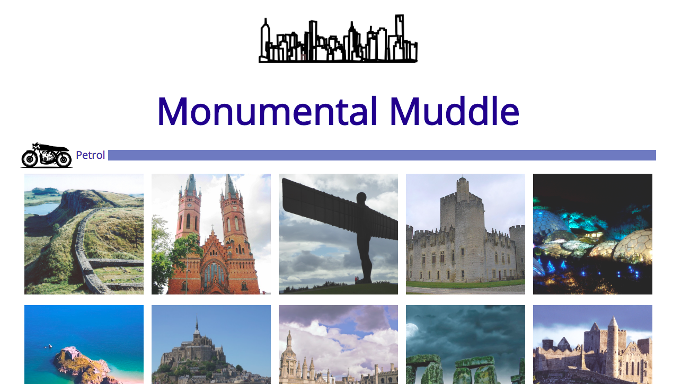

# Monumental Muddle

*The landing page for my game*

### Installation and setup
#### Run Locally

- Download or clone the [Github repo](https://github.com/hannahintech/wdi-first-project)

#### View Online

- [View on Heroku](https;//monumental-muddle.herokuapp.com)
- [View on Github](https://github.com/hannahintech/wdi-first-project)

*Gameplay*

### Technologies used

To create this project I used the following technologies:

- HTML5
- CSS
- Javascript
- jQuery
- Git
- Github
- Heroku

### Experience of the project
I felt I planned the project quite well, and had a final version after one week that reflected the time I had.

I still spent a little too much time on some elements and features, and even on the colour scheme, and I feel that I am gaining experience regarding how long things take me, and also how to do things more efficiently for next time.

During the project week I became more familiar with how jQuery behaves and after refactoring I started to understand better how I could accomplish the same task again, but with fewer changes and rework.

### What Next?
Small improvements to the codebase could be made, such as improved readability and how DRY my code is:
  * I could refactor some of my functions even further
  * my css could be simplified, so I could make better use of classes and specification
  * my html could also be changed slightly to help with readability

In terms of the game and the concept:
* I would like a feature where the player can see their "journey" and see the names of all the places in the grid
* I would like to tackle accessibility and consider a way my game could be playable by everyone. Unfortunately I didn't have enough time to work on this aspect
* I wanted to add some additional jQuery animations, and I would enjoy adding them at a later date
* My biggest goal for future changes would be to use an api to source the country images for the game, so that the images would be different each time, and more countries could be added. This would make the game even more educational, as well as being fun to play!
